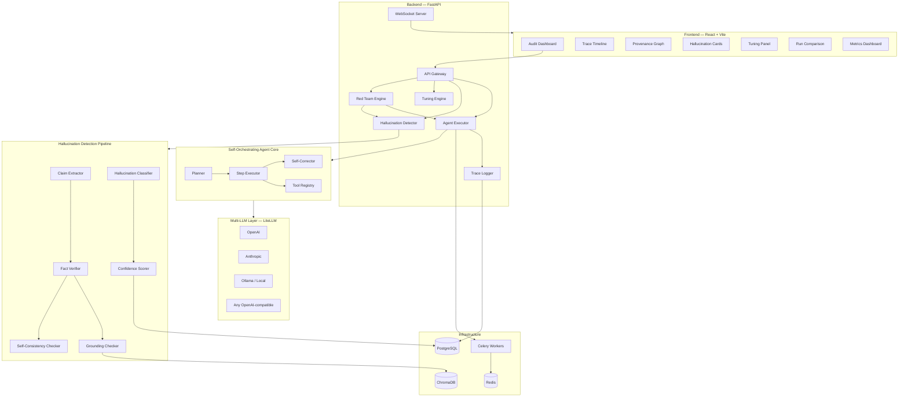
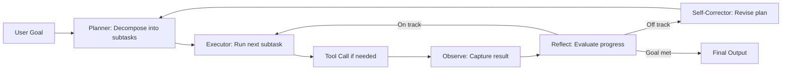

# Lucid — Hallucination Auditor for Self-Orchestrating AI Agents

**Lucid** (adj.) — *thinking or expressing oneself clearly; not hallucinating.*

A portfolio-grade AI security research tool that provides an **auditable, inspectable, and tunable** pipeline for detecting, classifying, and reducing hallucinations in self-orchestrating agentic AI systems. Users can trace every decision an autonomous agent makes, see exactly where it hallucinates, and tune parameters to reduce errors — all through a polished web dashboard.

---

## Tech Stack

| Layer | Technology | Rationale |
|-------|-----------|-----------|
| **Backend** | Python 3.12 + FastAPI | Native LLM ecosystem, async, auto-docs |
| **Frontend** | Vite + React + TypeScript | Fast dev, modern tooling, type safety |
| **Database** | PostgreSQL (traces, metadata) | Structured audit data, robust querying |
| **Vector Store** | ChromaDB | Lightweight, embeddable, good for RAG grounding |
| **LLM Abstraction** | LiteLLM | Unified API across OpenAI, Anthropic, Ollama, etc. |
| **Task Queue** | Celery + Redis | Async agent execution, long-running tasks |
| **Deployment** | Docker Compose + cloud-ready | Local dev + one-click deploy to any cloud |
| **Testing** | Pytest + Playwright | Backend unit/integration + frontend E2E |

---

## Architecture



---

## Proposed Project Structure

```
lucid/
├── docker-compose.yml
├── Dockerfile.api
├── Dockerfile.frontend
├── README.md
├── .env.example
│
├── backend/
│   ├── pyproject.toml
│   ├── alembic/                    # DB migrations
│   ├── app/
│   │   ├── main.py                 # FastAPI app entrypoint
│   │   ├── config.py               # Settings & env vars
│   │   ├── models/                 # SQLAlchemy / Pydantic models
│   │   │   ├── trace.py
│   │   │   ├── hallucination.py
│   │   │   └── tuning.py
│   │   ├── api/                    # Route handlers
│   │   │   ├── runs.py
│   │   │   ├── traces.py
│   │   │   ├── hallucinations.py
│   │   │   └── tuning.py
│   │   ├── agent/                  # Self-orchestrating agent
│   │   │   ├── orchestrator.py     # Main agent loop
│   │   │   ├── planner.py          # Goal → subtask decomposition
│   │   │   ├── executor.py         # Step execution
│   │   │   ├── corrector.py        # Self-correction logic
│   │   │   └── tools/              # Tool implementations
│   │   │       ├── registry.py
│   │   │       ├── web_search.py
│   │   │       ├── file_ops.py
│   │   │       └── calculator.py
│   │   ├── detection/              # Hallucination detection
│   │   │   ├── claim_extractor.py
│   │   │   ├── fact_verifier.py
│   │   │   ├── grounding_checker.py
│   │   │   ├── consistency_checker.py
│   │   │   ├── classifier.py
│   │   │   └── scorer.py
│   │   ├── red_team/               # Adversarial red-teaming
│   │   │   ├── generator.py        # Adversarial prompt generation
│   │   │   ├── runner.py           # Automated sweep execution
│   │   │   ├── analyzer.py         # Vulnerability analysis
│   │   │   └── templates/          # Adversarial prompt templates
│   │   │       ├── ambiguous.py
│   │   │       ├── temporal.py
│   │   │       ├── niche_domain.py
│   │   │       └── multi_step.py
│   │   ├── llm/                    # Multi-LLM abstraction
│   │   │   ├── provider.py         # LiteLLM wrapper
│   │   │   └── config.py           # Model configs
│   │   └── services/               # Business logic
│   │       ├── trace_service.py
│   │       └── audit_service.py
│   └── tests/
│
├── frontend/
│   ├── package.json
│   ├── src/
│   │   ├── App.tsx
│   │   ├── pages/
│   │   │   ├── Dashboard.tsx
│   │   │   ├── TraceView.tsx
│   │   │   ├── RunComparison.tsx
│   │   │   ├── RedTeamView.tsx
│   │   │   └── TuningPanel.tsx
│   │   ├── components/
│   │   │   ├── TraceTimeline.tsx
│   │   │   ├── ProvenanceGraph.tsx
│   │   │   ├── HallucinationCard.tsx
│   │   │   ├── ConfidenceBadge.tsx
│   │   │   └── MetricsChart.tsx
│   │   ├── hooks/
│   │   ├── services/               # API client
│   │   └── styles/
│   └── tests/
│
├── data/
│   ├── benchmarks/                 # Test scenarios
│   └── examples/                   # Example traces
│
└── docs/
    ├── research_writeup.md
    └── api.md
```

---

## Phase 1: Project Scaffolding & Infrastructure

> **Goal**: Set up a production-grade project skeleton with CI, Docker, and all infrastructure services running locally.

- [ ] Initialize monorepo structure
- [ ] **Backend setup**
  - [ ] Python project with `pyproject.toml` (dependencies: fastapi, uvicorn, sqlalchemy, alembic, litellm, chromadb, celery, redis, pydantic)
  - [ ] FastAPI app skeleton with health check endpoint
  - [ ] PostgreSQL connection with SQLAlchemy async
  - [ ] Alembic migration setup
  - [ ] ChromaDB client initialization
  - [ ] Redis + Celery worker configuration
  - [ ] Pydantic settings with `.env` support
- [ ] **Frontend setup**
  - [ ] Vite + React + TypeScript project
  - [ ] Install: react-router, recharts (charts), @xyflow/react (provenance graph), framer-motion (animations)
  - [ ] Design system: CSS variables, dark theme, typography (Inter font)
  - [ ] API client service with fetch wrapper
- [ ] **Infrastructure**
  - [ ] `docker-compose.yml` with services: api, frontend, postgres, redis, chromadb
  - [ ] `Dockerfile.api` and `Dockerfile.frontend`
  - [ ] `.env.example` with all required config
  - [ ] GitHub Actions: lint (ruff), type-check (mypy), test (pytest), frontend lint+build
- [ ] **Verify**: `docker compose up` launches all services, health check returns OK

---

## Phase 2: Self-Orchestrating Agent Core

> **Goal**: Build a custom, fully-traceable self-orchestrating agent that receives a high-level goal, decomposes it into a plan, executes steps autonomously, self-corrects, and logs every decision with full provenance.

### Agent Loop Design

The agent follows a **Plan → Execute → Observe → Reflect → Correct** loop, similar to systems like OpenClaw/Devin:



### Tasks

- [ ] **Multi-LLM provider layer**
  - [ ] LiteLLM wrapper with provider config (model name, API key, base URL)
  - [ ] Support: OpenAI (gpt-4o, gpt-4o-mini), Anthropic (claude-3.5-sonnet, claude-4), Ollama (llama3, mistral, etc.)
  - [ ] Switchable per-run: user selects model at run creation time
  - [ ] Token counting and cost tracking per call
  - [ ] Retry logic with exponential backoff

- [ ] **Agent orchestrator**
  - [ ] `Orchestrator.run(goal: str, model: str, config: AgentConfig) → Trace`
  - [ ] Main loop: plan → execute → observe → reflect → correct (or complete)
  - [ ] Maximum step limit (configurable, default 20)
  - [ ] Timeout per step (configurable, default 60s)
  - [ ] Graceful termination on error or limit

- [ ] **Planner module**
  - [ ] Receives high-level goal, outputs structured plan: `List[Subtask]`
  - [ ] Each subtask: `{id, description, dependencies, tools_needed, status}`
  - [ ] Re-planning capability: can revise plan mid-execution based on new information

- [ ] **Step executor**
  - [ ] Executes one subtask at a time
  - [ ] Resolves which tool to call (or pure reasoning)
  - [ ] Captures full input/output for each step

- [ ] **Tool registry**
  - [ ] Pluggable tool interface: `class Tool(ABC): name, description, parameters, execute()`
  - [ ] Built-in tools:
    - `web_search` — search via SerpAPI or Tavily
    - `read_url` — fetch and parse web page content
    - `calculator` — evaluate math expressions
    - `note_taker` — store/retrieve working notes
  - [ ] Tool call logging: input args, output, latency, errors

- [ ] **Self-corrector**
  - [ ] After each step, evaluate: "Is the result correct? Is the plan still valid?"
  - [ ] Detect and flag: tool errors, empty results, contradictory information
  - [ ] Can trigger re-planning or retry with different approach

- [ ] **Trace logging**
  - [ ] DB schema: `Run`, `TraceStep`, `ToolCall`, `LLMCall`
  - [ ] Every LLM call logged: full prompt (system + user + assistant), response, model, tokens, latency, cost
  - [ ] Every tool call logged: tool name, args, result, duration
  - [ ] Agent state snapshots: current plan, completed steps, working memory
  - [ ] API endpoints:
    - `POST /api/runs` — start a new agent run
    - `GET /api/runs` — list all runs
    - `GET /api/runs/{id}` — get run details + all trace steps
    - `GET /api/runs/{id}/steps` — paginated trace steps
    - `DELETE /api/runs/{id}` — delete a run
  - [ ] WebSocket endpoint for real-time step streaming during execution

- [ ] **Verify**: Run the agent with goal "Research the latest advances in quantum computing and summarize the top 3 breakthroughs", inspect full trace in DB

---

## Phase 3: Hallucination Detection Pipeline

> **Goal**: Automatically detect and classify hallucinations in every agent output at every step.

### Hallucination Taxonomy

| Type | Description | Example |
|------|-------------|---------|
| `intrinsic` | Contradicts the source material the agent retrieved | Agent says "The paper found X" when the paper says "not X" |
| `extrinsic` | States facts unsupported by any retrieved source | Agent invents statistics not in any search result |
| `fabricated_citation` | Invents references, URLs, paper titles, or authors | Agent cites "Smith et al. 2024" which doesn't exist |
| `reasoning_error` | Logical flaw in the chain-of-thought | Agent concludes A → B when the evidence shows A → C |
| `tool_misuse` | Misinterprets tool output or uses wrong tool | Agent treats a calculator error as a valid result |
| `self_contradiction` | Agent contradicts its own earlier statements | Step 3 says "X is true", Step 7 says "X is false" |

### Tasks

- [ ] **Claim extraction module**
  - [ ] LLM-based decomposition: response → list of atomic claims
  - [ ] Each claim tagged with type: `factual`, `numerical`, `citation`, `reasoning`, `opinion`
  - [ ] Each claim linked to its source step ID
  - [ ] Structured output: `Claim(id, text, type, source_step_id, source_span)`

- [ ] **Fact verification engine**
  - [ ] **Grounding check**: embed claims + source docs → cosine similarity → grounded/ungrounded
  - [ ] **Citation verification**: extract URLs/references → attempt to fetch → verify content matches claim
  - [ ] **Cross-reference check**: use a second LLM (different model) to verify factual claims independently
  - [ ] **Self-consistency check**: run the same step N times (default 3), measure agreement via semantic similarity
  - [ ] Each check returns: `VerificationResult(method, verdict, confidence, evidence, explanation)`

- [ ] **Hallucination classifier**
  - [ ] Takes: claim + verification results → hallucination type + severity
  - [ ] Severity levels: `none`, `minor` (cosmetic inaccuracy), `moderate` (misleading), `critical` (completely fabricated)
  - [ ] LLM-assisted classification with structured output

- [ ] **Confidence scorer**
  - [ ] Aggregate score per claim (0.0–1.0) based on weighted verification results
  - [ ] Aggregate score per step (average of claim scores)
  - [ ] Aggregate score per run (weighted average, more weight on later steps)

- [ ] **Detection storage**
  - [ ] DB models: `Claim`, `VerificationResult`, `HallucinationFinding`
  - [ ] API endpoints:
    - `POST /api/runs/{id}/analyze` — trigger hallucination analysis on a completed run
    - `GET /api/runs/{id}/hallucinations` — get all findings for a run
    - `GET /api/runs/{id}/claims` — get all extracted claims with verdicts
  - [ ] Background processing via Celery (analysis can be slow)

- [ ] **Benchmarking dataset**
  - [ ] Curate 50–100 test scenarios across domains (science, history, current events, math)
  - [ ] Each scenario includes: goal, expected key facts, known pitfalls
  - [ ] Include adversarial prompts designed to trigger specific hallucination types
  - [ ] Script to run benchmarks and collect metrics

- [ ] **Verify**: Run analysis on a completed trace, confirm hallucinations are detected and correctly classified

---

## Phase 4: Audit Dashboard (Frontend)

> **Goal**: Build a stunning, interactive web dashboard where users can inspect every agent decision, see hallucinations highlighted in context, and explore the full provenance of each claim.

### Design Principles
- Dark theme with vibrant accent colors (greens for grounded, reds for hallucinated, amber for uncertain)
- Glassmorphism cards with subtle blur effects
- Smooth micro-animations (framer-motion) for state transitions
- Information-dense but not overwhelming — progressive disclosure via expandable panels

### Tasks

- [ ] **Dashboard home page**
  - [ ] Run list with summary cards: goal, model used, step count, hallucination count, overall confidence
  - [ ] Quick filters: by model, by date, by hallucination severity
  - [ ] "New Run" button → modal with goal input, model selector, config options
  - [ ] Real-time status for in-progress runs (WebSocket)

- [ ] **Trace timeline view** (`/runs/{id}`)
  - [ ] Vertical timeline showing each agent step in order
  - [ ] Step cards showing: step type (plan/execute/reflect/correct), summary, timestamp, duration
  - [ ] Color-coded confidence indicators on each step (green/amber/red glow)
  - [ ] Expand any step to see:
    - Full LLM prompt (system + user messages)
    - Full LLM response
    - Tool calls with inputs/outputs
    - Token usage and cost
    - Detected hallucinations (inline highlighted)
  - [ ] Step-to-step navigation with keyboard shortcuts

- [ ] **Hallucination detail cards**
  - [ ] For each hallucination finding, show:
    - The specific claim text (highlighted in agent output)
    - Hallucination type badge with color
    - Severity indicator
    - Evidence panel: side-by-side of claim vs. source material with diff highlighting
    - Verification method breakdown (which checks passed/failed)
    - Confidence score with visual gauge
  - [ ] Filterable by type and severity

- [ ] **Provenance graph** (`/runs/{id}/graph`)
  - [ ] Interactive DAG (using @xyflow/react) showing information flow
  - [ ] Node types: goal, subtask, tool call, LLM response, claim, hallucination
  - [ ] Edges show data flow: which tool output fed which reasoning step
  - [ ] Click any node to see full context in a side panel
  - [ ] Highlight path: click a hallucination → trace back to its origin
  - [ ] Zoom, pan, fit-to-screen controls

- [ ] **Run comparison view** (`/compare`)
  - [ ] Select two runs (e.g., same goal with different models or parameters)
  - [ ] Side-by-side trace comparison
  - [ ] Diff of final outputs
  - [ ] Hallucination count comparison (bar chart)
  - [ ] Claim-level agreement matrix

- [ ] **Metrics overview** (`/metrics`)
  - [ ] Aggregate hallucination rate chart (over time, per model)
  - [ ] Breakdown by hallucination type (donut chart)
  - [ ] Per-tool reliability scores (which tools cause more hallucinations)
  - [ ] Cost vs. accuracy scatter plot (across models)
  - [ ] Before/after tuning comparison charts

- [ ] **Verify**: Full E2E flow — start a run, watch it execute, inspect trace, view hallucinations, explore provenance graph

---

## Phase 5: Tuning, Mitigation & Adversarial Red-Teaming

> **Goal**: Let users adjust agent behavior to reduce hallucinations, **and** proactively discover weaknesses through automated adversarial testing. All changes and test results are versioned so their impact can be measured.

### 5A: Tuning & Mitigation Controls

- [ ] **Prompt tuning panel**
  - [ ] Edit system prompts for planner, executor, reflector, and corrector
  - [ ] Few-shot example editor: add/remove/reorder examples
  - [ ] Tool description editor: refine tool descriptions to reduce misuse
  - [ ] Save prompt versions with timestamps and diffs
  - [ ] A/B test: run same goal with two prompt versions, compare results

- [ ] **Guardrail configuration**
  - [ ] Confidence threshold: minimum score to accept a step (below → trigger re-do)
  - [ ] Mandatory citation mode: agent must cite sources for every factual claim
  - [ ] Max retries per step before escalating
  - [ ] Tool output validation rules (regex, JSON schema)
  - [ ] "Human-in-the-loop" breakpoints: pause at specific step types for manual review
  - [ ] Toggle individual guardrails on/off, measure impact

- [ ] **Retrieval tuning** (for grounding)
  - [ ] Adjust: chunk size, overlap, top-k results, embedding model
  - [ ] Side-by-side: retrieved chunks vs. relevant chunks (precision/recall)
  - [ ] Re-index with different settings and compare

- [ ] **Model parameter controls**
  - [ ] Temperature, top-p, max tokens, frequency/presence penalty sliders
  - [ ] Per-module overrides (planner may need different temp than executor)
  - [ ] Save parameter presets
  - [ ] Track parameter → hallucination rate correlation scatter plot

- [ ] **Configuration versioning**
  - [ ] Every config change creates a versioned snapshot
  - [ ] Run comparison can filter by config version
  - [ ] "Config diff" view showing what changed between versions

### 5B: Adversarial Red-Teaming

> Built-in "red team" mode that automatically generates adversarial prompts designed to maximize hallucination rates, helping users discover their agent's weakest points before real users do.

- [ ] **Adversarial prompt generator**
  - [ ] LLM-powered generator that creates goals designed to trigger specific hallucination types
  - [ ] Template categories, each targeting different failure modes:
    - `ambiguous` — vague or underspecified queries that tempt the agent to fill gaps with fabricated details
    - `temporal` — questions about recent/future events where training data is stale
    - `niche_domain` — obscure topics where the agent is likely to confuse or invent facts
    - `multi_step_reasoning` — long reasoning chains where errors compound
    - `citation_bait` — prompts that pressure the agent to cite sources (testing fabricated citations)
    - `contradiction_trap` — queries with conflicting information in retrieved sources
  - [ ] Parameterized difficulty levels (easy, medium, hard)
  - [ ] User can also add custom adversarial prompts to the library

- [ ] **Automated red-team sweep**
  - [ ] `POST /api/red-team/sweep` — run an adversarial suite against a specified model + config
  - [ ] Runs all prompts from selected categories through the full agent → detection pipeline
  - [ ] Parallelized via Celery workers for speed
  - [ ] Progress tracking via WebSocket (live updates to dashboard)
  - [ ] Configurable: select which categories, how many prompts, which models to test

- [ ] **Vulnerability analysis & reporting**
  - [ ] Aggregate results into a **vulnerability report**:
    - Overall hallucination rate under adversarial conditions
    - Breakdown by adversarial category (which attack types are most effective)
    - Breakdown by hallucination type (which failure modes are most triggered)
    - Per-model comparison: "Model A resists temporal attacks but fails on citation bait"
  - [ ] Heatmap visualization: adversarial category × hallucination type × model
  - [ ] "Weakest link" indicator: highlights the single highest-risk combination
  - [ ] Historical tracking: compare vulnerability across config versions

- [ ] **Red-team dashboard page** (`/red-team`)
  - [ ] Suite configuration panel: select categories, models, difficulty
  - [ ] "Launch Sweep" button with live progress bar
  - [ ] Results view: vulnerability heatmap, model comparison charts, drill-down to individual adversarial runs
  - [ ] Link from any adversarial finding → full trace in the audit timeline
  - [ ] Export vulnerability report as JSON/PDF

- [ ] **Red-team → Tuning feedback loop**
  - [ ] From any vulnerability finding, one-click "Create tuning experiment" → pre-fills the tuning panel with the failing scenario
  - [ ] After tuning, one-click "Re-run adversarial suite" to verify improvement
  - [ ] Track: adversarial hallucination rate before vs. after each tuning change

- [ ] **Verify**:
  - [ ] Run a red-team sweep with default prompts, confirm vulnerability report is generated
  - [ ] Change a prompt, re-run the sweep, confirm before/after comparison shows change
  - [ ] Verify the full loop: red-team finds weakness → tune → re-test → improvement tracked

---

## Phase 6: Research Outputs & Portfolio Polish

> **Goal**: Make this project shine. Proper documentation, metrics, a demo, and a research write-up.

- [ ] **Research write-up** (`docs/research_writeup.md`)
  - [ ] Problem statement: hallucination risks in self-orchestrating agents
  - [ ] Related work: existing hallucination detection approaches, their limitations
  - [ ] Methodology: Lucid's detection pipeline, classification taxonomy
  - [ ] Results: hallucination rates across models and scenarios, effect of mitigations
  - [ ] Discussion: which hallucination types are hardest to detect, which mitigations work best
  - [ ] Future work

- [ ] **README & documentation**
  - [ ] Hero banner / logo
  - [ ] Architecture diagram
  - [ ] Feature screenshots / GIFs
  - [ ] Quickstart: `docker compose up` → working demo
  - [ ] Configuration reference
  - [ ] API documentation (auto-generated from FastAPI `/docs`)
  - [ ] Contributing guide

- [ ] **Demo preparation**
  - [ ] Pre-loaded example runs with interesting hallucination findings
  - [ ] Seed database script for instant demo
  - [ ] 2–3 minute recorded walkthrough video
  - [ ] Live demo script for presentations

- [ ] **Cloud deployment**
  - [ ] Terraform/Pulumi templates for AWS (ECS/Fargate) or GCP (Cloud Run)
  - [ ] Environment-specific configs (dev, staging, prod)
  - [ ] HTTPS with auto-cert (Caddy or Let's Encrypt)
  - [ ] Basic auth or API key protection for public demos

- [ ] **Verify**: Fresh clone → `docker compose up` → full working demo with pre-loaded data

---

## Future Enhancements Guide

> These are extensions that go beyond the core MVP. Each is a self-contained feature that can be added incrementally after the base project is complete.

### 1. Multi-Agent Orchestration Auditing
**What**: Extend Lucid to trace and audit *interactions between multiple agents* — not just a single agent's reasoning, but how agents delegate, collaborate, and potentially amplify each other's hallucinations.

**Why it matters**: Multi-agent systems (AutoGen, CrewAI, swarm patterns) introduce new failure modes — one agent's hallucination becomes another agent's "fact."

**Implementation sketch**:
- Add `AgentSession` model linking multiple `Run` traces
- Cross-agent provenance edges in the graph
- New hallucination type: `propagated` — a hallucination that originated in Agent A and was accepted as fact by Agent B
- Inter-agent message inspection panel

---

### 2. Fine-Tuned Hallucination Detection Model
**What**: Train a lightweight classifier (e.g., fine-tuned DeBERTa or DistilBERT) on your labeled hallucination data instead of relying entirely on LLM-based detection.

**Why it matters**: LLM-based detection is slow and expensive. A fine-tuned model runs in milliseconds and can be used for real-time detection.

**Implementation sketch**:
- Export labeled claims from the DB as training data
- Fine-tune on hallucination type classification
- Serve via ONNX runtime for fast inference
- Use as a first-pass filter; escalate uncertain cases to LLM verification
- Track model accuracy over time as more data is labeled

---

### 3. Real-Time Streaming Audit
**What**: Instead of post-hoc analysis, detect hallucinations *as the agent generates output*, with live confidence scoring streamed to the dashboard.

**Why it matters**: Enables proactive intervention — stop the agent mid-execution when hallucination risk is high.

**Implementation sketch**:
- Token-level streaming from LLM → incremental claim extraction
- Lightweight grounding check on partial outputs
- WebSocket push of live confidence scores to frontend
- "Pause" button that fires when confidence drops below threshold
- Visual: real-time confidence graph that updates as the agent thinks

---

### 4. Plugin SDK for Custom Detectors
**What**: A developer-friendly SDK for creating custom hallucination detection plugins — domain-specific checkers that go beyond generic fact verification.

**Why it matters**: Different domains have different hallucination patterns (medical claims vs. code correctness vs. financial data).

**Implementation sketch**:
- Python abstract base class: `class HallucinationDetector(ABC): detect(claim, context) → Finding`
- Plugin discovery via entry points or a plugin directory
- Plugin configuration UI in the dashboard
- Example plugins: `CodeExecutionVerifier` (run code claims), `DateChecker` (verify temporal claims), `MathVerifier` (check calculations)

---

### 5. CI/CD Integration — Hallucination Regression Testing
**What**: Run Lucid as part of a CI/CD pipeline to catch hallucination regressions when prompts, models, or tools change.

**Why it matters**: As teams iterate on their agent systems, they need automated testing to ensure hallucination rates don't increase.

**Implementation sketch**:
- CLI tool: `lucid benchmark run --suite research_assistant --model gpt-4o --threshold 0.15`
- GitHub Actions integration: run benchmarks on PR, fail if hallucination rate exceeds threshold
- Trend tracking: hallucination rate over commits
- Slack/Discord webhook notifications for regressions

---

### 6. Compliance & Audit Report Export
**What**: Generate formal PDF/HTML audit reports suitable for compliance reviews, client deliverables, or academic submissions.

**Why it matters**: Enterprise adoption requires auditable documentation, and research submissions need reproducible results.

**Implementation sketch**:
- Report templates (PDF via WeasyPrint, HTML via Jinja2)
- Sections: executive summary, methodology, findings, evidence, recommendations
- Filterable: by severity, by date range, by model
- Digital signatures for report integrity
- Scheduled report generation (weekly, per-run)

---

### 7. Adversarial Prompt Marketplace
**What**: Extend the built-in red-teaming (Phase 5B) with a community-contributed library of adversarial prompts, where users can share and rate attack templates that exposed hallucinations in their agents.

**Why it matters**: Crowdsourced adversarial testing covers more edge cases than any single team can devise.

**Implementation sketch**:
- Public API for submitting adversarial prompt templates with metadata (category, target hallucination type, difficulty)
- Rating system: upvote prompts that reliably trigger hallucinations
- Import/export prompt packs (JSON format)
- Integration with the red-team sweep: pull community prompts alongside built-in ones

---

### 8. Community Benchmark Leaderboard
**What**: A public leaderboard where different model + prompt + guardrail configurations are ranked by hallucination resistance on standardized benchmarks.

**Why it matters**: Creates community engagement, drives adoption, and provides a public good for AI safety research.

**Implementation sketch**:
- Standardized benchmark suites (versioned, reproducible)
- Submission API: users submit their config, Lucid runs the benchmark
- Leaderboard frontend: model rankings by overall score and by hallucination type
- Badges for configs that achieve certain thresholds (e.g., "< 5% hallucination rate")
- Public API for programmatic access to results

---

## Verification Plan

### Automated Tests
- **Backend unit tests**: Claim extractor, fact verifier, classifier, red_team/ generator — all with mocked LLM responses
- **Integration tests**: Full pipeline from agent run → detection → API response
- **Benchmark suite**: 50+ scenarios run against all supported models, track metrics
- **Frontend E2E**: Playwright tests covering dashboard, RedTeamView → trace view → hallucination cards → tuning panel
- **CI gate**: `pytest --cov` with >80% coverage on `detection/` and `red_team/` modules

### Manual Verification
- Deploy via `docker compose up`, run a demo scenario end-to-end
- Verify the audit dashboard correctly renders traces and hallucination findings
- Test tuning controls and confirm they affect hallucination rates on re-runs
- Browser walkthrough of all dashboard views
- Fresh clone test: someone unfamiliar follows the README and gets a working demo

---

## Suggested Timeline

| Phase | Estimated Duration | Milestone |
|-------|--------------------|-----------|
| Phase 1: Scaffolding | 3-4 days | `docker compose up` works, all services healthy |
| Phase 2: Agent Core | 1-1.5 weeks | Agent completes a research task with full trace logged |
| Phase 3: Detection | 1-1.5 weeks | Hallucinations auto-detected and classified on real traces |
| Phase 4: Dashboard | 1.5-2 weeks | Full audit UI functional with all views |
| Phase 5A: Tuning | 1 week | Users can tune and see impact |
| Phase 5B: Red-Teaming | 1-1.5 weeks | Adversarial sweep runs, vulnerability report generated |
| Phase 6: Polish | 1 week | Deploy-ready with docs, demo data, and write-up |
| **Total** | **~7-9 weeks** | Production-quality portfolio piece |

> [!TIP]
> **MVP shortcut (3-4 weeks)**: Phases 1 + 2 + 3 + basic Phase 4 (trace timeline + hallucination cards only). Skip provenance graph, tuning, red-teaming, and comparison view for MVP. Add them iteratively.
